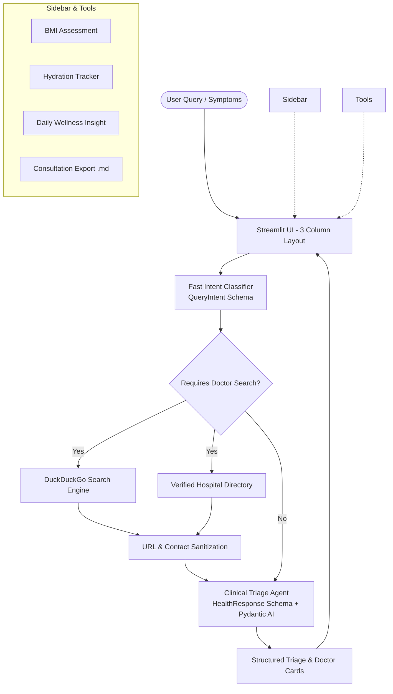

<div align="center">

# 🩺 Health Assistant AI

### Intelligent Medical Triage & Local Healthcare Discovery

An ultra-responsive health assistant chatbot built with **Streamlit**, **Pydantic AI**, and **Groq Cloud API** for clinical symptom triage and local doctor discovery.

[](https://www.python.org/)
[](https://streamlit.io/)
[](https://ai.pydantic.dev/)
[](https://groq.com/)

[**Overview**](#-overview) • [**How to Access & Use**](#-how-to-access--use) • [**Key Features**](#-key-features) • [**Quick Start**](#-quick-start) • [**System Architecture**](#-system-architecture) • [**Testing**](#-testing) • [**Disclaimer**](#️-medical-disclaimer)

---

</div>

## 🌟 Overview

**Health Assistant AI** assists users in evaluating symptoms and finding verified healthcare facilities. Powered by Groq inference and structured Pydantic schemas, it delivers clinical evaluation, safe home recovery steps, warning signs, and verified local clinic contact details.

The web interface features a responsive three-column dashboard with integrated health tools including a BMI calculator, a hydration tracker, daily health insights, and consultation export.

---

## 🌐 How to Access & Use

### 1. Access the Web Application
Start the local server (see [Quick Start](#-quick-start)), then open your browser to:

```text
http://localhost:8501
```

> **Network Access**: If running on a local network, access the interface from other devices using the `Network URL` displayed in your terminal (e.g., `http://192.168.x.x:8501`).

### 2. Enter Your Groq API Key
You can provide your Groq API key in either of two ways:
- **Environment file (Recommended)**: Add `GROQ_API_KEY=your_key_here` to a `.env` file in the project root.
- **In-App Sidebar**: In the web UI, expand the **Settings** section in the left sidebar and enter your key.

### 3. Configure Your Location
- Click **🌐 Auto-Detect via IP** in the right column (**Wellness Hub**) to automatically detect your locality.
- Or enter your city or neighborhood manually in the **Clinic & Doctor Finder** (e.g., `Kolkata, West Bengal` or `Austin, Texas`). All doctor searches will tailor to this location.

### 4. Chat & Health Tools
- **Symptom Consultation**: Type health inquiries or choose a suggested query in the central chat interface.
- **BMI Assessment**: Enter weight and height in the left column for instant BMI calculations and healthy weight targets.
- **Hydration Tracker**: Log water intake (+250ml / +500ml) toward your daily goal in the right column.
- **Export Summary**: Click **📥 Export Medical Summary** in the sidebar to download your consultation record as a Markdown document.

---

## ✨ Key Features

- **Clinical Symptom Triage**: Structured evaluation of user symptoms providing immediate assessments, self-care measures, and red-flag warnings.
- **Two-Tier Model Orchestration**: Fast intent and specialty detection followed by structured clinical triage with Pydantic validation.
- **Local Healthcare Discovery**: Real-time doctor search via DuckDuckGo integrated with a directory of accredited regional hospitals and clinics.
- **Location Detection & Override**: IP-based geolocation with an instant manual city/area override.
- **Interactive Health Suite**: Built-in BMI calculator, daily hydration log, and daily wellness tips.
- **Session Privacy**: Chat histories remain in your local browser session and can be cleared or exported at any time.

---

## 🚀 Quick Start

### Prerequisites
- **Python 3.10+**
- A **Groq API Key** (available free from [Groq Console](https://console.groq.com/keys))

### Installation

1. **Clone the repository:**
   ```bash
   git clone https://github.com/REBDRA/Health-Assistant-Chatbot.git
   cd Health-Assistant-Chatbot
   ```

2. **Create a virtual environment:**
   ```bash
   # On Windows
   python -m venv .venv
   .venv\Scripts\activate

   # On Linux/macOS
   python3 -m venv .venv
   source .venv/bin/activate
   ```

3. **Install dependencies:**
   ```bash
   pip install -r requirements.txt
   ```

4. **Set up your environment variables:**
   Create a `.env` file from the example template:
   ```bash
   # On Linux/macOS
   cp .env.example .env

   # On Windows PowerShell
   Copy-Item .env.example .env
   ```
   Configure your Groq API key inside `.env`:
   ```ini
   GROQ_API_KEY=your_groq_api_key_here
   DEFAULT_LOCATION=Kolkata, West Bengal, India
   ```

5. **Start the application:**
   ```bash
   python main.py
   ```
   *Alternatively:*
   ```bash
   streamlit run app.py
   ```

---

## 🏗️ System Architecture



---

## ⚙️ Configuration Options

| Variable | Type | Required | Description |
| :--- | :---: | :---: | :--- |
| `GROQ_API_KEY` | String | Yes* | Groq API key for LLM inference (*can also be entered directly in the web UI sidebar*). |
| `DEFAULT_LOCATION` | String | No | Fallback location when IP auto-detection is unavailable. Default: `Kolkata, West Bengal, India`. |

---

## 🧪 Testing

The repository includes a suite of automated unit tests covering Pydantic schemas, URL sanitization, search term cleaning, and doctor directory lookups.

Run tests using pytest:

```bash
python -m pytest
```

---

## 📁 Repository Structure

```
Health-Assistant-Chatbot/
├── .devcontainer/         # Dev container configuration
├── .github/workflows/     # CI workflow (python-app.yml)
├── .streamlit/
│   └── config.toml        # Streamlit theme and server configuration
├── tests/
│   └── test_health_app.py # Unit and integration test suite
├── ai_service.py          # AI agent definitions, schemas, and doctor discovery
├── app.py                 # Streamlit web application & interface logic
├── main.py                # Launch script
├── pyproject.toml         # Project metadata and dependencies
├── requirements.txt       # Python package dependencies
├── .env.example           # Environment template
└── README.md              # Project documentation
```

---

## ⚠️ Medical Disclaimer

> [!WARNING]
> **Health Assistant AI is intended for informational and educational triage purposes only.**
> It does not provide medical diagnoses, clinical prescriptions, or formal treatment plans, and is not a substitute for evaluation by a licensed healthcare professional.
>
> If you are experiencing a life-threatening condition, severe chest pain, shortness of breath, sudden numbness, or heavy bleeding, contact your local emergency services immediately:
> - **India**: `112` / `108`
> - **United States / Canada**: `911`
> - **Europe / UK**: `112` / `999`
